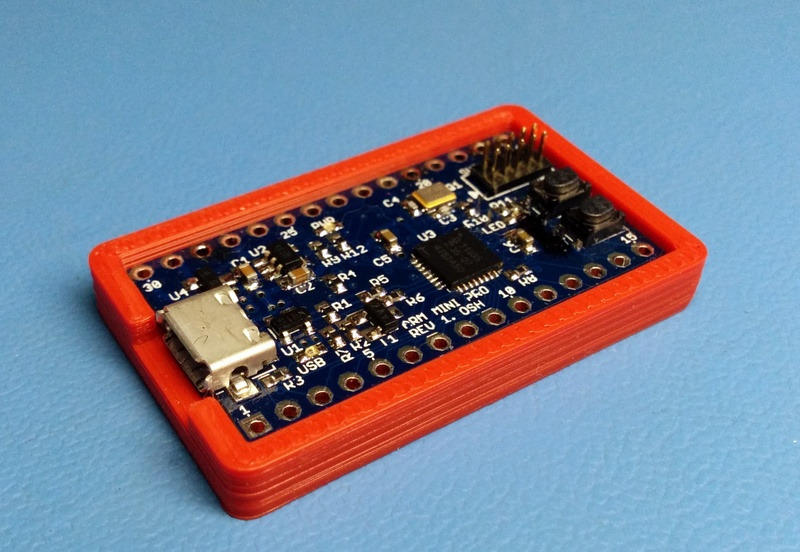
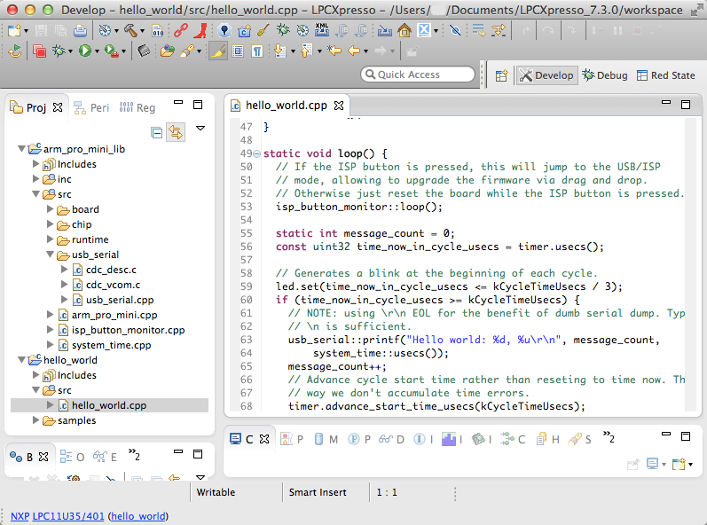
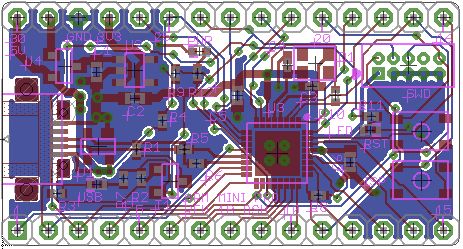

ARM PRO MINI
============

### OVERVIEW

ARM PRO MINI is a small barebone open source ARM M0 microcontroller board that is great for 
quick prototyping and as a starting point for your own ARM based custom designs. 
It was designed and named after the venerable Arduino Pro Mini and it is an excellent 
stepping stone for makers and hobbyists 'graduating' from Arduino to the ARM architecture.




[Schematic (PDF)](https://github.com/zapta/arm/blob/master/pro-mini/eagle/arm-pro-mini-schematic.pdf?raw=true)

[BOM (PDF)](https://github.com/zapta/arm/blob/master/pro-mini/eagle/arm-pro-mini-bom.pdf?raw=true)

[Case 3D Model](https://github.com/zapta/arm/blob/master/pro-mini/3d/arm-pro-mini-enclosure.stl)


<br>
### Highlights

* Prototyping friendly. Compatible with standard soldieries breadboards and can be soldered to a standard 0.1” proto board.
* Straight forward barebone design. Customize for your own PCB design by selecting the portions of the circuit you need.
* Single package install of the free and fully feature IDE (NXP Eclipse/LPCXpresso).
* Zero software installation when using with the mbed.org online IDE.
* Full support of Windows, Mac OSX and Linux.
* Easy firmware upgrade using a file drag and drop. Programmers and adapters are not required, even if you are bringing up your own board!
* Supports optional debuggers (such as the [OM13014,598](http://www.digikey.com/short/7zbr3m)) for single stepping and full debugging capabilities.
* I/O library and a hello world example (with serial printing over USB, parallel port io, blinking LED, and timing).
* No nonsense open source license (no commercial restrictions, sharing and attribution not required).


<br>
### Specification

Attribute | Value
:--------- | :-----
MCU | NXP ARM M0 LPC11U35FHI33/501
Memory | 64K flash, 8K RAM, 4K EEPROM
Speed | 48Mhz
Core voltage | 3.3V   (3.3V LDO included)
MCU Package | QFN 5x5mm, 0.5mm pitch, 32 pads + ground tab.
PCB dimensions | 1.5” x 0.775”  (38.1mm x 19.7mm)
PCB Layers | 2
PCB Thickness | 1mm recommended. (standard 1.6mm is also OK).
PCB file format | Eagle + PDF + Gerber files.
PCB rules | 6mil min trace, 7mil min spacing.
SMT Technology | 0402, QFN 0.5mm pitch.
Power options | USB, ext 3.3v, ext 16V max (with included 3.3V LDO) 
Header pins | 2x15 DIP, 0.7” row spacing. Access to all MCU's I/O pins.
USB Connector | Micro B
Debugger Connector | SWD 2x5 pin header, 0.5” pitch
Crystal | 12Mhz (for 48Mhz MCU operation).
LEDS | Power (blue), USB status (green), Application (red), 
Switches | Reset, ISP.
Recomanded IDE | NXP LPCXpresso (eclipse based, free)


<br>
### Pinout Diagram


<br>
### Quick Start 1 - Uploading a Compiled Program

This section will teach you how to load new firmware on your board. It is done by switching the board to the USB/ISP virtual disk mode and copying the new binary file.

1. Connect the ARM PRO MINI board to a USB port of a Max OSX, Linux or Windows computer.
2. Restart the board while the ISP button is pressed to enter the USB/ISP mode (with some practice, this can be done with a simple roll of one finger):
    * Press and hold the RST button.
    * Press and hold the ISP button.
    * Release the RST button.
    * Release the ISP button.
3. The ARM PRO MINI will mount itself on your computer as an external disk with a single file named firmware.bin.
4. Copy one of the two provided hello world image files over the *firmware.bin* file. Note: on Mac OSX drag and drop does not work, instead using the cp shell command: *cp hello_world_fast_blink.bin "/Volumes/CRP DISABLD/firmware.bin"*
5. Press the RST button of the ARM PRO MINI to restart it in the RUN mode. The image file you just loaded should start running and the red LED on the ARM PRO MINI should blink.
6. Repeat the process with the other image file *hello_world_slow_blink.bin*  and notice how the blinking rate changes.

For more information about the USB bootloader see NXP's [application note AN11305](resources/lpc_bootloader/AN11305v.1.pdf).


<br>
### Quick Start 2 - Using the USB/Serial port.

This section will teach you how to view on your computer seial data output from the ARM PRO MINI. It is useful for example to communicate with a program running on the ARM PRO MINI or to debug a program you write using print messages.

1. Load and run a hello world image file as described above. Make sure the red LED blinks.
2. Identify the serial port on your computer. 
    * On Mac OSX:  run _ls /dev/tty.usb*_, the port name looks like */dev/tty.usbmodemNXP-71*.
    * On Linux: TBD
    * On Windows: TBD (may required the NXP CDC driver [here](resources/lpc_bootloader).
3. Use a terminal emulator to print the text received on the serial port you identified above.
    * On Mac OSX: run the command screen <port_name>. For example *screen /dev/tty.usbmodemNXP-71*
    * On Linux: TBD
    * On Windows: TBD

The output will look like this:
~~~
...
Hello world: 4, 1500177
Hello world: 5, 1800178
Hello world: 6, 2100178
Hello world: 7, 2400178
Hello world: 8, 2700177
...
~~~


<br>
### Quick Start 3 - Installing the LPCXpresso IDE and compiling Hello World.

This section will teach you how to install the NXP LPCXpresso IDE and how to setup and compile a project for the ARM PRO MINI.

1. Download and Install the LPCXpresso IDE as described here http://www.lpcware.com/lpcxpresso/download. (this tutorial verified with LPCXpresso V7.3.0 on Mac OSX 10.9.5).
2. Copy the project directory https://github.com/zapta/arm/tree/master/pro-mini to your computer (e.g. by cloning the github repository or by extracting the zip file https://github.com/zapta/arm/archive/master.zip).
3. Import the *arm_pro_mini_lib* and *hellow_world* projects into LPCXpresso:
    * Select *File | Import... | General | Existing Projects into workspace* and then click *Next*
    * Select the archive file *arm_pro_min_getting_started.zip*, verify that the two projects *arm_pro_mini_lib* and *hello_world* are selected and then click *Finish*.
4. Build the hello world image file:
    * Right click on the *hello_world* project and select *Build Project*.
    * Expand the *hello_world* project and verify that the image file *hello_world.bin* created in the Debug directory.
7. Load the generated *hello_world.bin* image file to the ARM PRO MINI board using the USB/ISP bootloader as described above.
8. Modify the file *src/hello_file.cpp* in the *hellow_world* project (e.g. change the value of *kCycleTimeUsecs*), rebuild and load the file and verify that your changes took effect.


<br>



TIP: The LPCXpresso's External Tools facility can be used to automate the process of building the project and uploading to the ARM PRO MINI. For details, see the provided Mac OSX script *copy_to_usb_isp.sh*.


<br>
### The ARM PRO MINI Library
This library includes everything you will need to program the ARM PRO MINI. It includes simplified low level chip and board definitions (based on LPCOPEN) as well as original code that support serial over USB/CDC, passive timers, digital pin I/O and more. It is installed in LPCXpresso as a library project which the hello world project (and in the future your own progrmas) depends on. The depenency is defined in the hello world LPCXpresso project such that compiling the hello world project also compiles the library if needed. 

<br>
### The Hello World Example
The provided hello world example is well documented and self explanatory. It uses several facilities from the arm_pro_mini_lib library such as serial printing over USB/CDC, 1usec system clock and passive timers (which allow to perform timing without the dreaded delay()). The hello world is is provided below for reference. The latest version can be found [here](lpcxpresso/hello_world/src/hello_world.cpp).  

``` cpp
// A basic hello world example using the arm_pro_mini library. It blinks the LED
// and prints to the USB/CDC serial port.

// These #include files are from the arm_pro_mini_lib library.

// The base arm_pro_mini_lib include.
#include "arm_pro_mini.h"

// Provides abstraction to digital I/o pins.
#include "io_pins.h"

// Provide system time using TIMER32 0.
#include "system_time.h"

// Provides interrupt free elapsed time measurement using system time.
#include "passive_timer.h"

// Provides serial I/O over USB/CDC.
#include "usb_serial.h"

// Allows to jump to ISP mode when ISP button is pressed.
#include "isp_button_monitor.h"

// LED blink cycle. We provide two prebuilt binaries with
// fast and slow blink respectively to be used in the
// Getting Started procedure.
//
static const uint32 kCycleTimeUsecs = 300 * 1000;  // fast
// static const uint32 kCycleTimeUsecs = 2000 * 1000;  // slow

// Timer for generating the delay bettween printed messages.
static PassiveTimer timer;

// Red LED is at GPIO0_7.
static io_pins::OutputPin led(0, 7);

static void setup() {
  arm_pro_mini::setup();
  // Uses timer32_0 for generating a 1 usec 32 bit clock (does not use interrupts).
  system_time::setup();
  // Initialize the USB serial connection. This will allow us to print messages.
  usb_serial::setup();
  // Get ready to monitor the ISP button
  isp_button_monitor::setup();
  // Reset the timer to the time now. This starts the first cycle.
  timer.reset();
}

static void loop() {
  // If the ISP button is pressed, this will jump to the USB/ISP
  // mode, allowing to upgrade the firmware via drag and drop.
  // Otherwise just reset the board while the ISP button is pressed.
  isp_button_monitor::loop();

  static int message_count = 0;
  const uint32 time_now_in_cycle_usecs = timer.usecs();

  // Generates a blink at the beginning of each cycle.
  led.set(time_now_in_cycle_usecs <= kCycleTimeUsecs / 3);
  if (time_now_in_cycle_usecs >= kCycleTimeUsecs) {
    // NOTE: using \r\n EOL for the benefit of dumb serial dump. Typically
    // \n is sufficient.
    usb_serial::printf("Hello world: %d, %u\r\n", message_count,
        system_time::usecs());
    message_count++;
    // Advance cycle start time rather than reseting to time now. This
    // way we don't accumulate time errors.
    timer.advance_start_time_usecs(kCycleTimeUsecs);
  }
}

int main(void) {
  setup();
  for (;;) {
    loop();
  }
}
```

<br>
### Compiling with the ARMmbed Online IDE.

The instructions above explain how to install and use the fully featured LPCXpresso IDE and tool chain. Another option that
ARM PRO MINI developes has it to use the ARM's free online IDE at mbed.org which doesn't require any sofrware installation. Following steps 
outline how to compile a simple blinky program for the ARM PRO MINI:

1. Login to http://mbed.org (a free registration is required) and go to the compiler section at https://developer.mbed.org/compiler
2. Add a LPC11u35/501 platform to your compiler configuration (requires only once). 
3. Create a new project and type in blinky program below.
4. CLick on the Compile button. This will compile the program and if the compilation was successful it will download the binary file named *mbed_blinky_LPC11U35_501.bin* to your computer.
5. Upload the binary file to your ARM PRO MINI board as described eariler in this document.


ARMmbed blinky program:
``` cpp
#include "mbed.h"

DigitalOut led(P0_7);  // LED pin.

int main() {
  for(;;) {
    led = !led;    // Invert LED state
    wait_ms(100);  // A short delay
  }
}
```


<br>
### Schematic Description
The [schematic](https://github.com/zapta/arm/blob/master/pro-mini/eagle/arm-pro-mini-schematic.pdf?raw=true) of the ARM PRO MINI is minimal and modular to make it easy to customize it for your own ARM based boards. It includes the MCU running at 48Mhz (using a 12Mhz crystal), USB protectiona and glue electronics, power source arbitraror (external and USB), 3.3V voltage regulator, SWD debugging header and a few LEDs and buttons.

When customizing for your own board, you can eliminate the optional parts that you don't need. For example, if your board already has a 3.3V regulator than you don't need the power arbitrarion diodes and and the LDO. The important thing to remember is that nothing is sacred about this cirtuit and you can adapt it as you wish.


<br>
### Building Your Own ARM PRO MINI



Building a ARM PRO MINI is stragiht forward as long as you are comfortable with working with SMT devices. The BOM is available here https://github.com/zapta/arm/blob/master/pro-mini/eagle/arm-pro-mini-bom.pdf?raw=true and all components can be sourced from Digikey. The PCB is two layers with trace/spacing requirements that are compatible with inexpensive vendors such as Elecrow and [OSHPark](https://oshpark.com/shared_projects/fw5118z7) (3 boards for a total of $6 shipped, as of Dec 2014) and the repository includes both eagle and gerber files (generated with Elecrow CAM file). For prototypes we used Elecrow 5x5cm max 1mm HASL PCB and 0.12mm (~5mil) laser cut metal stencil. Initial programming of a bootloader is not required and the board is ready to use straight out of your toaster oven.


<br>
### General Resources
* [LPC11U3X datasheet](https://github.com/zapta/arm/blob/master/pro-mini/resources/LPC11U3X/LPC11U3X_datasheet.pdf?raw=true) PDF (hardware).
* [LPC11U3X manual](https://github.com/zapta/arm/blob/master/pro-mini/resources/LPC11U3X/LPC11U3X_manual.pdf?raw=true) PDF (programming).
* LPC forums http://www.lpcware.com/forum
* EEVblog microcontrollers forum http://www.eevblog.com/forum/microcontrollers/

